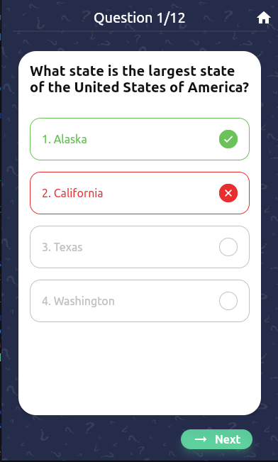
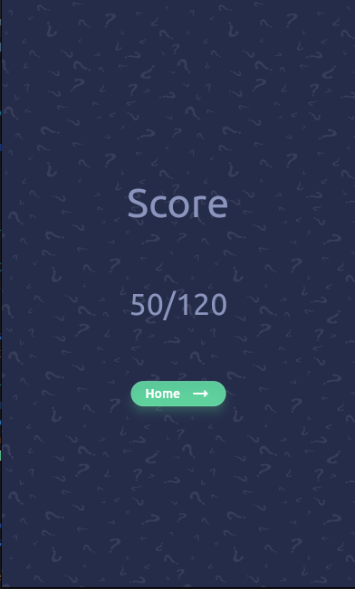

# quiz_game

This is a simple flutter quiz game

- Written with clean code, clean architecture and Test Driven Development
- In this game you can chose your desired trivia category , questions difficulty and amount of questions
- This app contact with [opentdb](https://opentdb.com) to retrieve questions and categories data using Dio http client
- Beautiful and easy to use user interface

## Screenshots
<table>
  <tr>
    <td></td>
    <td></td>
    <td></td>
  </tr>
 </table>

## ToDo:
- [X] Domain layer
  - [X] entities
      - [X] category
      - [X] question
   - [X] Repository
      - [X] trivia
  - [X] Use cases
      - [X] get categories
      - [X] get questions
- [X] Data layer
  - [X] Repository
      - [X] trivia repository implementation
  - [X] Models
      - [X] category
      - [X] question
  - [X] Data source
      - [X] trivia remote data source
- [X] Presentation layer
  - [X] home page
  - [X] questions page
  - [X] scores page

